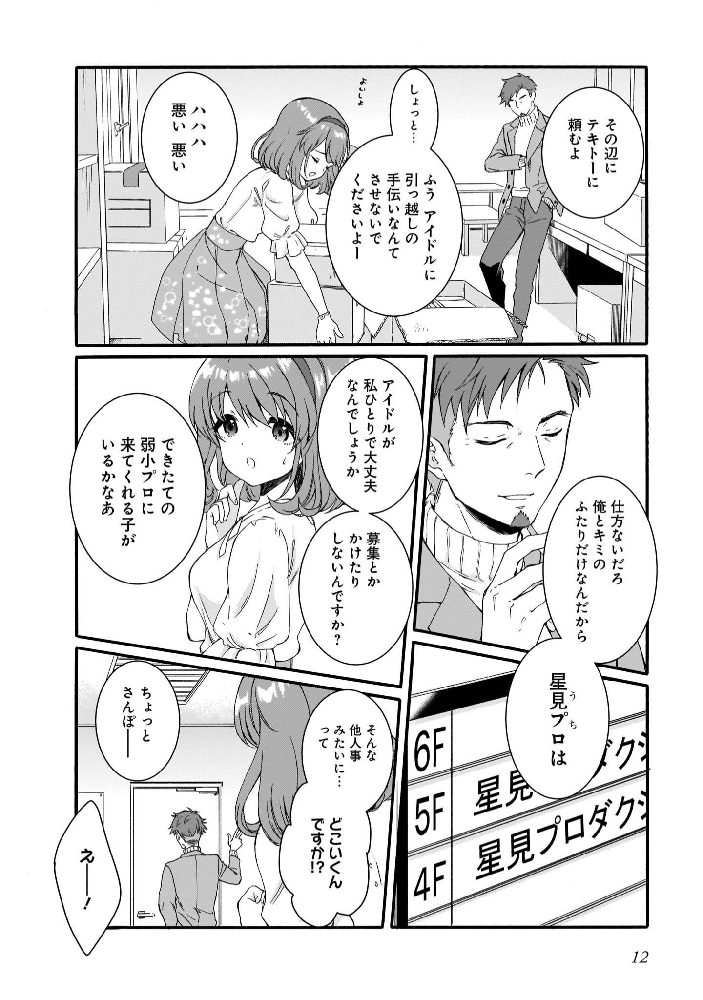
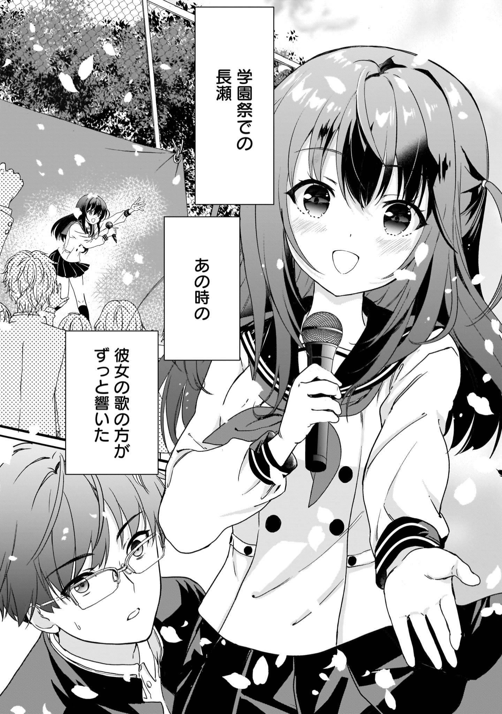

# P3 #

1. ごめんね　急に呼びだして
	1. 对不起，突然把你叫来
2. いや…大丈夫だけど…
	1. 不…没事，不过…
3. あのね
	1. 那个啊
4. 牧野くん…
	1. 牧野君…
5. 私…
	1. 我……

# P4 #

1. 私ね…
	1. 我想…

# P5 #

1. ねえ　麻奈！
	1. 呐，麻奈!
2. 今日カラオケいこーよ
	1. 今天去唱卡拉ok吧
3. えーそれより何が食べにいこーよ！ね？麻奈！
	1. 诶——还不如去吃点什么吧!是吧，麻奈？

# P6 #

1. うーん
	1. 唔……
2. どらしよっかなーー
	1. 怎么办呢——
3. えーいこよー
	1. 诶——去嘛——
4. あはは
	1. 啊哈哈
5. …長瀬…か
	1. ……长濑……吗……

# P7 #

1. まぶしいよなあつち側は
	1. 好耀眼啊
2. 俺と違つて
	1. 和我不同
3. おお！牧野！！
	1. 哦！牧野！！
4. おまえもついに目覚めたか
	1. 你也终于发现了吗
5. いいよな　LizNoir！
	1. 真好啊　LizNoir！
6. へ？
	1. 诶？
7. これか？いやテキトーに動画見てた　だけて…
	1. 这个吗？不，只是刚好在看视频而已…
8. 照れんあって！
	1. 别害羞!
9. 今度こっちでも　ライブ　やるんだぜ！
	1. 她们下次要来这边现场演出哦!
10. 牧野も俺らと行く？
	1. 牧野也和我们一起去吗?
11. …俺はいいよ
	1. ……我不了
12. アイドルに興味あるわけじやないし…
	1. 对偶像没有兴趣…
13. しゃーない　また気が向いたら　行こーぜ　牧野
	1. 不好意思，下次兴致来了再去吧牧野
14. ああ
	1. 嗯嗯

# P8 #

1. 牧野くん
	1. 牧野君
1. うわあ！？
	1. 哇!?
1. びっくりした！
	1. 吓了一跳!
1. なっ長瀬！？
	1. 长…长濑!?
1. 牧野くんって　アイドル嫌いなの？
	1. 牧野君讨厌偶像吗?
1. へ？
	1. 诶？
1. 嫌いっていうのとは　ちょっと違うと思う
	1. 我觉得和讨厌有点不同
1. どう違うの？
	1. 有什么不同?
1. え…うーーん　そうだな
	1. 呃…嗯，这么说吧

# P9 #

1. ちょっと　違い存在…
	1. 有点不同的存在…
2. という感じかな…
	1. 这样的感觉吧…
3. ふうん…
	1. 哦…
4. 麻奈ーー！
	1. 麻奈ーー！
5. 何やってんの　早くカラオケいこーー
	1. 你在做什么啊，快去卡拉ok !
6. あっ　うん
	1. 嗯
7. ばいばい　牧野くん
	1. 拜拜 牧野君
8. あああ
	1. 嗯嗯
9. 長瀬に　話かけられるなんて　びっくりした…
	1. 被长濑搭话真是吓了一跳…

# P10 #

1. だって　長瀬麻奈は　いつだって　みんなの輪の中心にいて
	1. 因为长濑麻奈总是在大家的中心
2. 誰がらも　愛される　人気者で
	1. 是人见人爱的红人
3. 一方　俺は　ただのその他大勢だ
	1. 另一方面，我只是个路人。

# P11 #

1. 社長ーー！　これどこに　置けきます？
	1. 社长!这个放在哪里?

# P12 #

1. その辺にデキトーーに頼むよ
	1. 在那附近　拜托你了
2. しょっと…
	1. 等等…
3. ふう　アイドルに　引っ越しの　手伝いなんて　きせないで　くだきいよー
	1. 不要让偶像帮你搬家哦~
4. ハハハ　悪い悪い
	1. 哈哈哈，抱歉抱歉
5. 仕方ないだろ　俺とキミの　ふたりだけなんだから
	1. 没办法的吧只有我和你两个人
6. 星見プロは（うち）
	1. 星见Pro
7. アイドルが　私ひとりで大丈夫なんでしょうか
	1. 只有我一个偶像 真没问题吗
8. 募集とか　かけたり　しないんですか？
	1. 不招募或者挖掘一下吗？
9. でけたての　弱小プロに　来てくれるこが　いるかなあ
	1. 那么，有谁会来找刚刚起步的事务所呢
10. そんな　他人事　みたいにって
	1. 像在说别人的事一样
11. どこいくんですか！？
	1. 你要去哪里??
12. ちょっときんばーー
	1. 我一会就回来
13. えーー！
	1. 哎——!

# P13 #

1. まったく　大丈夫かな　星見プロ
	1. 真是的　这样没问题吗　星见Pro
2. ん？
	1. 嗯？
3. 新しい　ライブハウスか
	1. 新的LIVE HOUSE吗
4. こんな　地方の町にも　增えたよな
	1. 在这样的小镇里也多起来了呢
5. アイドルか
	1. 偶像吗
6. アイドルなんて　みんな同じたと　思ってたけど
	1. 我以为偶像们都是一样的。
7. でも　違う
	1. 但不是。

# P14 #

1. 学園祭での長瀬　あの時の　彼女の歌の方が　ずっと響いた
	1. 学园祭上长濑那时她的歌一直回响着

# P15 #

1. もっと俺の胸に　響いたんだ
	1. 也在我心中回响着。
2. って　いやいや
	1. 不不不
3. なんで　長瀬と　比べでるんだ　俺
	1. 我为什么要拿长濑来比啊
4. …上手いだけじゃ　響かないん　だよなあ…
	1. …只是唱得好的话歌声是不会在心中回响的…
5. え？
	1. 嗯？
6. …？不審者…？
	1. …？可疑人员…？

# P16 #

1. よ…つと

# P17 #

1. んーー！カラオケもいいけど
	1. 嗯——!卡拉ok也不错
2. ここの方が　思いつきり歌えて　最高だなっ
	1. 这里能尽情歌唱真是太棒了
3. まあ　だーれも　聴いてないけどつ
	1. 唉，虽然谁也听不到

# P18 #

1. 悪いね　勝手に聴かせて　もらつた
	1. 不好意思，我擅自听见了
2. アカベラで　ここまで　聴かせるとは　たいしたものだ
	1. 你的阿卡贝拉能唱成这样，真了不起
3. キミの名前は…ん？
	1. 你的名字是…?
4. まっ　待ってくれ！　俺は決して怪しい者　じゃないんだ
	1. 等一下!我绝对不是什么可疑的人
5. 怪しい人は　みんな　そう言いますよね
	1. 奇怪的人都这么说。
6. それは　そうだか
	1. 那是吗
7. あっ　そうだ　名刺…！
	1. 啊对了名片…!
8. まだ　作つてないんだった
	1. 还没做呢
9. じゃあ　私帰るので
	1. 那我回去了。

# P19 #

1. あっ　待ってくれ！
	1. 等等!
2.　ひや！？
	1.　呀!
3.　キミっ　今度はステージで　歌ってみないか！？
	1.　你这次要不要在舞台上唱歌呢!?
4.　…へ？
	1.　…诶？
5.　んーー…　うーーん
6.　…
7.　うーーん

# P20 #

1. 行こっかな…　でもなあ　あやしいし　どーしよ
	1. 还是去吧…不过，这也太奇怪了
2. …長瀬　どうかした？
	1. ……长濑，怎么了?
3. え？
4. いや　なんかあさから　ずっと変だったから
	1. 你从早上开始就一直很奇怪
4. なにかあった？
	1. 发生了什么事？
5. あーー…
6. 実はちょっと　迷ってて　これに誘われたの
	1. 实际上，我有点犹豫，我被邀请去看这个
7. あ…これ　有名な　アイドルの…
	1. 啊…这个有名的偶像的…
8. 牧野くん知ってるの？
	1. 牧野你知道吗?

# P21 #

1. あ…よかったら　代わり牧野くんが行く？
	1. 啊…牧野君可以代替我去吗?
2. 相手の人には　連絡しておくから
	1. 我会和对方联系的
3. いや俺は　アイドルに興味は…　それに
	1. 不，我对偶像没有兴趣…而且
4. …やっぱり　長瀬が行つた方がいいよ
	1. ……还是长濑去比较好
5. なんで？
	1. 为什么?
# P22 #

6. 長瀬は歌え好きだろ？
	1. 长濑喜欢唱歌吧?
7. うん　そうだね
	1. 嗯，是啊
8. じやあ　私行くね　ばいばい　牧野くん　また明日
	1. 那，我先走了，牧野君，明天见。
9. …何　長瀬としゃべってんだよーー　*うらやましい*
	1. …为什么你在和长濑说话啊　*真羡慕*
10. うわっ
10. なんだよ　古田
	1. 什么啊古田
11. なの牧野　きいてくれよ
	1. 牧野，你听我说

# P23 #

1. 河野が風邪で　早退しちきつてよ～～
	1. 河野因为感冒早退了哦～
2. だからさ
	1. 所以啊
3. 今日俺と
	1. 今天和我一起去吧
4. あ　もしかして　あなたが　長瀬さん？
	1. 啊难道你就是长濑？

# P24 #

1. はじめまして　私　星見プロダクションの佐伯遥子です
	1. 初次见面，我是星见制作公司的佐伯遥子
2. わっ　私　長瀬麻奈です！はじめまして
	1. 我是长濑麻奈！初次见面
3. あの　三枝さんは…？
	1. 那个三枝先生…？
4. 私たちだげです　今夜は本物のライブを　ふたりで観てこいって
	1. 今晚我们两个人一起去看真正的现场演出
5. 本物のライブ…
	1. 真正的现场演出…
6. さっ　混んできましたね　入りましょうか
	1. 好拥挤啊，进去吧
7. 牧野！　こっちこっち！
	1. 牧野！这边这边！
8. …っ　すごい　人だなっ
	1. 人真多啊
9. もう３回も足踏まれたよ！
	1. 已经被踩了三次脚了！

# P25 #

1. やっばり　来るんじゃなかった
	1. 果然不应该来的
2. 何言ってんだよ！星見LizNoirが　来るなんて　そうそうないぞ！
	1. 你在说什么！LizNoir竟然来星见了，这可不常见啊！
3. そんなの俺には関係な…
	1. 那和我没关系…

# P26 #

# P27 #

# P28 #

1. 長瀬さん　どう？
	1. 长濑怎么样？
2. 彼女たち　三枝さんが前の現場でプロデュースした　アイドルなんですって
	1. 听说她们是三枝先生在之前的负责的偶像
3. そうなんですが　ん？…あれ…
	1. 是吗？诶…
4. 牧野くん…
	1. 牧野君…
# P29 #

1. アイドルなんて　興味ないって…それなのに　あんなに
	1. 他虽然说过对偶像什么的没兴趣…
2. ？長瀬さん？
	1. ？长濑？
3. …して
	1. 为…
4. え？
5. どうして
	1. 为什么

# P30 #

1. あそこに立ってるのが　わたしじゃないんだろう
	1. 站在那里的不是我呢
2. 長瀬さん…
	1. 长濑……

# P31 #

1. おはよう　牧野くん
	1. 早上好牧野君
# P32 #

2. うわっ　な　長瀬！？おはよう…？
	1. 长，长濑！？早上好…？
3. うん　あのね　牧野くん
	1. 嗯，牧野君
4. 今日の放課後　残ってくれる
	1. 今天放学后留下来
5. ？
6. …牧野くん
	1. 牧野君

# P33 #

1. ごめんね　急に呼びだして
	1. 对不起突然叫你
2. いや…大丈夫だけど
	1. 不，不是…虽然没关系
3. あのね　牧野くん…　私…　私ね…
	1. 那个 牧野君…我…我想…

# P34 #

1. アイドルになる
	1. 我想成为成为偶像
2. それでね　牧野くんには　わたしの
	1. 所以呢，希望牧野君

# P35 #

1. マネージャーになってほしいの
	1. 成为我的经纪人
2. 思えば
	1. 回想起来

# P36 #

1. ここからだったんだ
	1. 是从这里开始的
2. 俺と麻奈の光と陰が交差したのは…
	1. 我和麻奈的交错的光阴…

