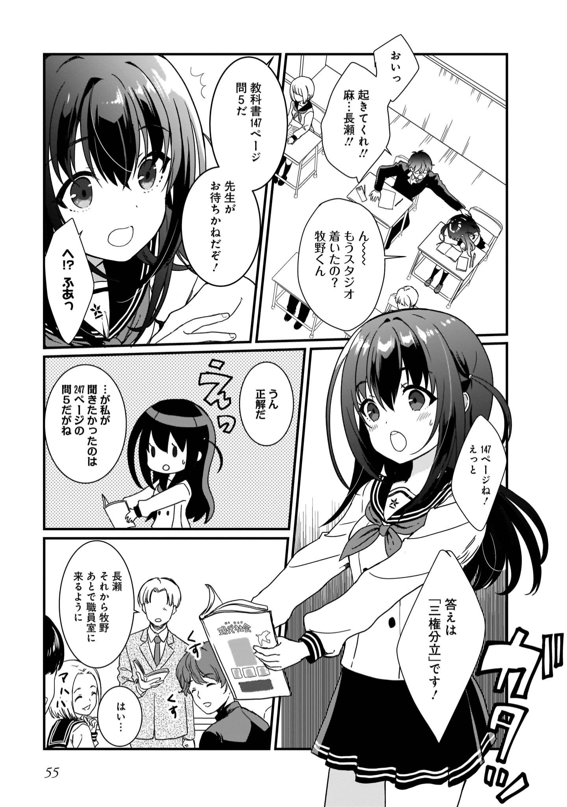
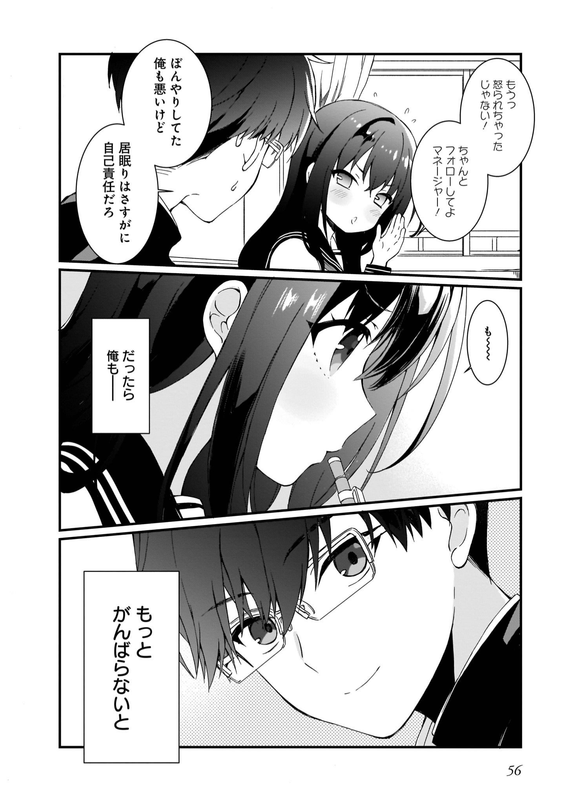

# P39 #

1. 牧野航平　高校2年…
	1. 牧野航平高中2年级学生…
2. 麻奈のクラスメイト　だっけ　…
	1. 是麻奈的同班同学吧…
3. は　はい
4. うーーん

# P40 #

1. 採用だ
2. え！？
3. 絶対　落ちると　思ってた…
	1. 我以为一定会落选…
4. やったね　牧野くん！！
	1. 太好了牧野君！！

# P41 #

1. まあ　高校生だから　最初は　アルバイトに　なるんだが
	1. 嘛，因为是高中生，一开始是打工的
2. おまえには　麻奈の専属　アシスタント　マネージャーに　なってもらう
	1. 让你成为麻奈的专属助理经纪人
3. ふたりで　デビュー　目指して　がんばってくれ
	1. 两个人以出道为目标加油吧
4. はい
5. …あの
6. ん？
7. 俺がいきなり　マネージャー　で　いいんですか？
	1. 我突然成为经纪人可以吗？
8. 高校生のバイトなのに…
	1. 明明是高中生的打工…
9. 話した通り　星見プロ　は　立ち上げたばかり　だからな　バイトだろうと　バリバリ働いてもらうぞ
	1. 正如我所说的，星见pro是刚成立的，所以就算是打工也要努力工作
10. ところで　アシスタントとはいえマネージャーというからには　其れなりの知識も必要なんだが
	1. 话说回来，虽说是助理，但既然是经纪人，那就需要相应的知识
11. 「VENUSプログラム」は知っているか？
	1. 知道「VENUS项目」吗？
12. はい　ざっくりと　ですが　アイドルのランクシステムみたいな　やつですよね
	1. 是的，大概是类似偶像等级制度的东西吧

# P42 #

1. そうだ　詳しいことはいずれわかってくるとはおもうが
	1. 对了，我想详细情况迟早会知道的
2. 麻奈もデビューしたら　「VENUSプログラム」に　登録するつもりだから　まずはがんばってみてくれ
	1. 麻奈出道后也打算注册到「VENUS项目」中，所以请先努力看看
3. がんばりますっ
	1. 加油
4. よし　じやあ早速都内のレッスンスタジオに行ってくれ
	1. 好吧，快去东京都内的训练室吧
5. ボイトレとダンスだ先方には連絡してある
	1. 联系了进行自我锻炼和跳舞的对方
6. じゃあ　行こっか　牧野く…
	1. 那我去　牧野…
7. じやなくって
	1. 不
8. 行こっ　マネージャー！
	1. 去吧　经纪人！
9. 引っ張るなよ　なが…　じやなくて　…　麻奈！
	1. 别拖我啊…长濑…不…麻奈！

# P43 #

1. はは　元気だな　若者は　結構なことだ
	1. 哈哈哈，年轻人真有精神啊
2. あの　三枝さん　今　麻奈ちゃんと　男の人が一緒に…
	1. 那个三枝先生　现在麻奈和男人在一起…
3. ああ
4. あいつは牧野航平　麻奈のクラスメイトで　今日から　麻奈のマネージャーだ
	1. 那家伙是牧野航平麻奈的同班同学，从今天开始是麻奈的经纪人
5. 高校生って　ことですか？
	1. 是高中生吗？
6. 高校生のマネージャーなんて　聞いたこよないですけど
	1. 高中生的经纪人什么的　我没听说过
7. もちろん　俺もフォローするさ
	1. 当然　我也会跟进的
8. どのみち　男手は欲しがったからな
	1. 反正现在需要男劳动力……
9. まあ　なんとかなるだろ
	1. 总会有办法的吧
10. はあ…

# P44 #

1. 長瀬さん腹式呼吸習ったことあるの
	1. 长濑有学过腹式呼吸吗
2. すごいわ　もうできてるじゃない
	1. 好厉害啊已经做好了吧
3. やった！褒められたよ　牧野くん！
	1. 太好了！牧野君　我被表扬了哟！
4. 俺に言わなくて　いいから　練習　集中して
	1. 不用告诉我，集中练习吧

# P45 #

1. うん！長瀬さん　ボックスは完璧ね！
	1. 嗯！长濑的方形步(BOX)真完美！
2. 以前動画を観て　覚えました！
	1. 以前看了视频记住了！
3. なら　サイドの動きも入れましょう
	1. 那么也加入侧面的动作吧
4. 私にいてきて　右 後ろ 左
	1. 跟我来，右ー后ー左ー
5. そう　うまい！
	1. 好！
6. すごい…
	1. 好厉害…

# P46 #

1. 歌がうまいのは　知ってたけど　ダンスもううまい
	1. 我只知道歌唱得很好，没想到舞也跳得很好
2. やっばり　麻奈には　才能があるんだ
	1. 果然麻奈有才能啊
3. 案外　マネージャーの仕事も　しすかりこなせる　かもしれないな
	1. 说不定经纪人的工作意外地很好处理呢
4. なんて　思っていた俺が
	1. 这样想着的我

# P47 #

1. 甘かった
	1. 真是太年轻了！
2. 牧野ーーこれを頼む！
	1. 牧野——拜托了！
3. はっ　はい！
4. 時間ないぞ　急げーー
	1. 没有时间了　快点吧
5. はい　もしもし　牧…
	1. 喂 你好 这里是牧…
6. じゃなかった　えっと　…　なんだっけ　…
	1. 不是…是什么来着…
7. 星見プロダクションです！
	1. 星见production
8. 牧野　あいさつ　回りいくぞーー
	1. 牧野　该去和客户打招呼了　该走了
9. はい…っ　うわっ

# P48 #

1. 「はじめての　ビジネスマナー」
	1. 第一次的商务礼仪
2. はあ…

# P49 #

1. もう　一週間経ったのに
	1. 已经过了一周了
2. 毎日失敗ばっかりだ
	1. 每天老是失败
3. 麻奈は最初からあんあにすごいのに　俺は
	1. 麻奈一开始就那么厉害，我…
4. 1‐2‐3！
5. 少しテンポ遅れたよ！
	1. 拍子有点慢了！
6. …はいっ
7. 少し休む？
	1. 稍微休息一下？
8. いえ　もう1回最初から　お願いします！
	1. 不，请从头开始再来一次！

# P50 #

1. ふい～～～～今日も私　レッスンがんばった～～！
	1. 呼～～～今天我的课也努力了～！

# P51 #

1. いい汗かいたーー！
	1. 出了好多汗！
2. けどつかれたよ～～～牧野く～～ん！！
	1. 但是累了～～～牧野～君！！
3. 俺の肩に思いっきり　もたれないでくれ
	1. 别随便靠在我肩膀上
4. んーーごめん　眠くて
	1. 嗯，对不起，我很困
5. 毎朝早起きして　体力づくりに　ランニングして
	1. 每天早上早起跑步锻炼体力
6. 帰るからも　習ったこと　復習しないとだから
	1. 回去了也得复习学过的东西
7. …こんな遅くまで　レッスンしてて　そんなことまで
	1. …到这么晚　开始上课　连那样的事都有
8. 学生とアイドルの二重生活ってすっごくたいへんだよ
	1. 学生和偶像的双重生活真的很不容易啊
9. ああ　それはみてて　わかるよ
	1. 啊　我看到了　知道了

# P52 #

1. よく学校に通いなから　アイドルしてる子が　いるけど…
	1. 虽然也有不经常去学校就做偶像的孩子…
2. その子たちはこんな努力してたんだね
	1. 那些孩子们是这么努力的啊
3. デビューしたちこんなもんじゃないと思う
	1. 出道的时候我觉得不是这样的
4. デビューが決まってる遥子さんのスケジュール麻奈よりずっと忙しそうだった
	1. 比起麻奈　决定出道的遥子的日程　看起来更忙
5. えーーっ
6. なんとかしてよ　牧野くん～～
	1. 想办法啊牧野君～～
7. じゃあ　デビューしたくない？
	1. 那你不想出道吗？
8. するよ
	1. 想出道
9. そこは　即答なんだ
	1. 即答啊

# P53 #

1. 当たり前　私はステージで歌うために　この世界に入ったんだよ
	1. 当然　我是为了在舞台上唱歌　才进入这个世界的
2. 睡眠時間を削ってでも　やり遂げてみせるから
	1. 就算减少睡眠时间也要完成
3. そんなこと言って　学校でねるなよ？
	1. 这么说的话，不要在学校里睡觉哦？
4. 寝るないよぉ！
	1. 才不会睡！
5. 才能に秀でた　麻奈でも　こんなにがんばってるんだ
	1. 才能出众的麻奈也这么努力着
6. だったらおれは
	1. 那么我也要

# P54 #

1. 学校では寝るないて言ってたのに
	1. 明明说过在学校不睡觉的
2. ヤバい　今　先生に　当てられたら
	1. 不妙现在被老师叫起来的话
3. 右足…　左足…　　軸をブラさな…い
	1. 右脚…左脚…重心摇摇晃晃的…不，不
4. では　この問いを　長瀬
	1. 那么这个问题就由长濑来回答吧

# P55 #

1. おいっ　起きてくれ　麻…長瀬！！
	1. 起来吧麻…长濑！！
2. ん～～～もうスタジオ　着いたの？牧野くん
	1. 嗯~已经到工作室了吗？牧野君
3. 教科書147ページ　問５だ
	1. 教科书147页问题5
4. 先生がお待ちかねだぞ！
	1. 老师等你很久了！
5. へ！？ふあ？
6. 147ページね！えっと
	1. 147页呢！嗯，那个
7. 答えは「三権分立」です！
	1. 答案是“三权分立”！
8. うん　正解だ　…　がわたしが　聞きたかったのは　247ページの問５だがね
	1. 嗯，正确…但我想问的是247页的问题5
9. 長瀬　それから　牧野　あとで　職員室に来るように
	1. 长濑、牧野，一会来办公室一趟
10. はい…

# P56 #

1. もうっ　怒られちゃったじゃない！
	1. 真是的，这不是被骂了吗！
2. ちゃんよ　フォローしてよ　マネージャー！
	1. 好好跟进　经纪人！
3. ぼにゃりしてた　俺も悪いけと　居眠りはさすがに　自己責任だろ
	1. 软绵绵的　我也不好　但打瞌睡是自己的责任吧
4. も～～～
5. だったら俺も
	1. 那么我也要
6. もっとがんばらないと
	1. 更加努力
