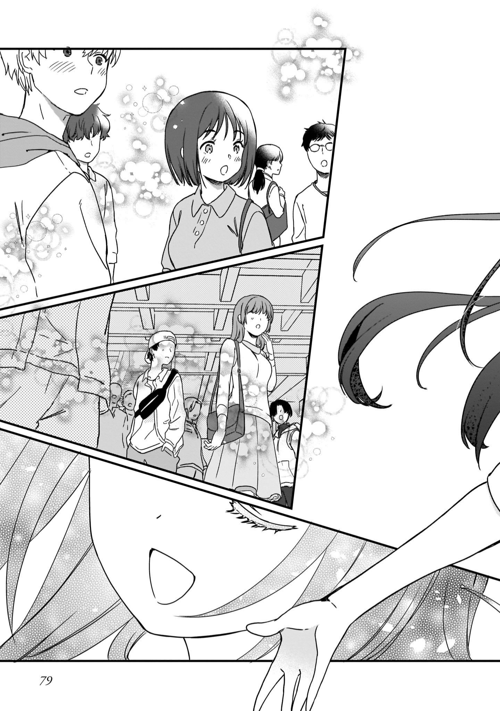

# P59 #

1. あれから10か月
	1. 从那以后过了十个月
2. 星見プロダクションの牧野と申します
	1. 我是星见production的牧野
3. だいぶ　マネージャーが　板についてきたな
	1. 经纪人渐渐做得得心应手了啊
4. さつきの　プロデューサーも　褒めてたぞ
	1. 刚才的制作人也夸你了哦
5. いえ　まだまだです
	1. 没有没有　还差得远
6. 麻奈と俺は　学業と芸能活動を　二人三脚で　続けていった
	1. 麻奈和我两个人一直一起应对着学业和演艺活动
7. 長瀬さん　今のすごく　よかったわよ
	1. 长濑 现在真是太好了
8. ありがとう　ございます！
	1. 非常感谢！
9. 知らないことばかりで　たいへんだったけど　同時に新鮮な体験だった
	1. 虽然尽是些不知道的事情，但同时也是新鲜的体验

# P60 #

1. え？
2. デビュー…？
	1. 出道…？

# P61 #

1. え…　私…が　てすか　…？
	1. 我……吗？
2. そうだ
	1. 对
3. おめでとう！　やったね　まなちゃん
	1. 恭喜！太棒了
4. 本当ですか！？ずいぶん急に決まるんですね
	1. 真的吗！？决定得真急啊
5. アイドルのデビューは　いろいろな要素が　重なって決まる
	1. 偶像的出道是由各种各样的要素重叠在一起决定的
6. 実力　周囲の状況　最適なタイミングを　計っていたんだ
	1. 我计算了实力　周围的状况　最合适的时机
7. いつどこで　歌わせてもらえるんですか？
	1. 什么时候能让我在哪里唱歌呢？
8. 来月　星見公園の野外ステージでデビューライブだ
	1. 下个月将在星见公园的野外舞台上举行出道演唱会

# P62 #

1. 大舞台でデビューというわけには　いかないったか…
	1. 在大舞台出道　怎么说呢…
2. でも目指していた　デビューに　辿り着いたんだ
	1. 但是终于到达了出道的目标
3. 私も応援にいくよ！
	1. 我也去加油哦！
4. 絶対　盛り上げようね！
	1. 一定要炒热气氛哦！
5. うん　遥子ちゃん　嬉しいよ　ありがとう
	1. 嗯，遥子，我很高兴，谢谢你
6. …麻奈…？

# P63 #

1. なあ　何が不満なんだ？
	1. 你有什么不满吗？
2. …どうして　わかったの？
	1. …你怎么知道的？
3. これでも一応　麻奈のマネージャーだからな
	1. 因为暂且也是麻奈的经纪人嘛
4. バイトだけど
	1. 虽然是兼职
5. さすかだね
	1. 真不愧是你
6. 牧野くん　私の場合はことよく　見てくれてるんだ
	1. 牧野君在好好地关注着我的情况

# P64 #

1. 話してくれよ　何が不満なんだ？
	1. 能告诉我吗，你不满的事情？
2. 麻奈の目指してた　ステージに　立てるんだぞ
	1. 麻奈的目标是站在舞台上
3. 牧野くん　誤解しないて　デビューは　ゴールじゃなくて　スタートなの
	1. 牧野君不要误会　出道不是终点而是起点
4. 私も調べてみたの
	1. 我也调查了一下
5. 今はね毎年100組以上のアイドルがデビューしてるんだって
	1. 听说现在每年有100组以上的偶像出道
6. だけどそのほんどが　デビューしただけで消えちゃう…
	1. 但是真的只是出道就消失了…

# P65 #

1. でも　私はたくさん歌いたい
	1. 但是我想多唱一些
2. みんなに聴いてほしい
	1. 希望大家听见
3. デビューしてすぐ…消えたくない…
	1. 不想刚出道就消失…
4. 麻奈…
5. …バカだ俺
	1. …我真傻
6. 一生懸命働いているだけで満足して
	1. 只是拼命工作就满足了
7. デビューさえできればプロにさえなればいいと思っていた
	1. 我觉得只要能出道的话，只要成为专业人士就好了
8. その先のことは考えたことも
	1. 在那之后的事情我也考虑过了
9. …麻奈の気持ちはわかったよ
	1. …我明白了麻奈的心情

# P66 #

1. 俺も覚悟を決めた
	1. 我也下定了决心
2. できる限りのことをしよう
	1. 尽力而为
3. 長瀬麻奈の歌をたくさんの人に届けるために
	1. 为了把长濑麻奈的歌传达给更多人

# P67 #

1. …うん　ありがとう
	1. …嗯，谢谢
2. 頼りにしてるね！
	1. 很可靠呢！
3. よしっ　じゃあ何げらやろっか
	1. 好 那该干什么呢？
4. そうだな　やっばり　…
	1. 是啊 果然应该…

# P68 #

1. 長瀬麻奈のデビューライブでーす！
	1. 長瀬麻奈要在演唱会上出道！
2. 来週の5月5日星見公園の野外ステージで行います！
	1. 下周的5月5日在星见公园的野外舞台举行！
3. 星見市出身のアイドルです！
	1. 是星见市出身的偶像！
4. よろしくお願いします！
	1. 请多关照！
5. 星見プロダクションの長瀬麻奈でーす
	1. 我是星见production的长濑麻奈

# P69 #

1. うーん…
2. なかなかもらってくれないな…
	1. 很难派出去啊…
3. ビラぐらいもらってくれると思ったのにね…
	1. 我还以为大家都会拿我的传单呢…
4. 麻奈はまだいいよ　ふたりにひとりは　もらってくれてるし
	1. 麻奈还好一点　发两个人有一个人收
5. 俺は全敗だぞ
	1. 我就完全不行了
6. でもこういう　自主的な　宣伝は大事だと思う
	1. 但是我觉得这种自主的宣传很重要
7. 今はなりふりかまってられ　ないんだ
	1. 现在不能装腔作势
8. おれたちだけでがんばろう
	1. 我们就自己努力吧
9. 「明日こそーー！」
	1. 「明天继续——！」
9. うん！がんばろう　おーー！
	1. 嗯！加油吧！

# P70 #

1. 次の日
	1. 第二天
2. 次の次の日
	1. 第三天
3. 「長瀬麻奈！長瀬麻奈！長瀬麻奈のデビューライブです！」
	1. 「长濑麻奈！长濑麻奈！这是长濑麻奈的出道演唱会！」
4. 「長瀬麻奈をよろしくおねがいします！」
	1. 「长濑麻奈请多关照！」
5. その次の日…
	1. 第四天
6. な…長瀬麻奈でーす…
	1. 长濑麻奈……
7. 長瀬麻奈に清き一票を…
	1. 给长濑麻奈清澈的一票…
8. 麻奈…選挙演説みたいになってるぞ
	1. 麻奈…这可不是竞选演说…

# P71 #

1. はら笑顔！
	1. 灿烂的笑容！
2. そんなこと言ったって…
	1. 说那种话也…
3. あっ　お願いします！
	1. 啊，拜托了！
4. う…　うう～～～
	1. 嗯…呜呜～～
5. ま　麻奈　大丈夫か…？
	1. 麻奈　没事吧…？
6. ヘコむよ　さすがに…
	1. 也太打击人了……
7. 全然チラシもらってくれないもん…
	1. 完全不接我传单…
8. このままじゃライブに誰も来てくれないよ…
	1. 这样的话，谁也不会来看演唱会的…

# P72 #

1. このままじゃまずい
	1. 这样下去可不好
2. 何が他の方法をかんがえないと…
	1. 不考虑其他方法的话…
3. 星見市のみなさーーん！
	1. 星见市的各位朋友！
4. こんいちはーー！
	1. 你好——！
5. 今度デビューする　悠木菜子でーす♡
	1. 这次悠木菜子要出道了♡
6. 今日は５月5日に新宿ルミナで行われる
	1. 5月5日在新宿举行
7. わたしのデビューライブの宣伝に参上しました！
	1. 这是我的出道演唱会的宣传！

# P73 #

1. すごい　宣伝トラック…
	1. 好厉害 宣传卡车…
2. 5日…私と同じ日にデビューするんだ…
	1. 5日…和我同一天出道的…
3. なんだあのこかわいーな！
	1. 什么啊　那个好可爱啊！
4. 新人アイドルか？
	1. 新人偶像？
5. 大手バンプロが　星見市で　告知なんて　力入ってるな～～～
	1. 大型货车　在星见市的宣传之类的很投入啊～～
6. あっ

# P74 #

1. …悔しい
	1. ……好后悔
2. こんなことで決まっちゃらなんて…
	1. 还没有结束呢…
3. 麻奈…
4. 歌なら負けない…
	1. 唱歌的话不会输…
5. 絶対にまけないのに！
	1. 明明绝对不会输的！

# P75 #

1. そうだ！
	1. 对了！
2. 麻奈！！歌おう！
	1. 麻奈！！唱吧！
3. 俺たちには最高の武器があるじゃないか！
	1. 我们不是有最好的武器吗！
4. こ…ここでうたうの？
	1. 在…在这里唱歌吗？
5. 今から？オケも衣装もないんだよ？
	1. 现在开始？歌曲伴奏和服装都没准备好哦？
6. 音源なら俺のスマホに入ってる　最大音量で鳴らそう
	1. 音源的话就用我手机里的最大音量来吧
7. で　でも…
	1. 但是…
8. 学園祭でのライブで立派な衣装を着てたか？
	1. 在学园祭的演唱会上穿了很漂亮的衣服吗？
9. スビーカーだって　オンボロだったろ？
	1. 麦克风也不太好用吧？

# P76 #

1. 麻奈が歌うことが大事なんだ！
	1. 麻奈的歌才是最重要的！
2. 長瀬麻奈は　歌なら誰にも負けない！
	1. 长濑麻奈唱歌的话　不会输给任何人！
3. …わかった　デビュー前の路上レッスンだね
	1. …知道了　是出道前的路上课程吧
4. やろう！
	1. 干吧！

# P77 #

# P78 #

# P79 #

# P80 #

1. 来週デビューの新人　長瀬麻奈です！
	1. 下周出道的新人长濑麻奈！
2. デビューライブよろしくおねがいします！
	1. 出道演唱会请多关照！
3. チラシください！
	1. 请给我传单！
4. 俺も！
	1. 我也要！
5. ライブ絶対行く！
	1. 绝对要去演唱会！

# P81 #

1. 来週はもつと歌うから
	1. 下周我会好好唱的
2. 絶対来てね！
	1. 一定要来哦！

# P82 #

1. まったく…勝手に宣伝活動とはな…
	1. 真是…擅自宣传活动啊…
2. 交通に支障をきたすなと　警察に𠮟られたぞ
	1. 警察说不要给交通带来不便了

# P83 #

1. す…すみません　予想以上に人が集まって
	1. 嗯…对不起，比预想的人还多
2. だが　よくやった
	1. 但是做得很好
3. 誰かが動画サイトに麻奈の映像上げていた
	1. 有人在视频网站上上传了麻奈的视频
4. もう１００万再生間近だ
	1. 已经快100万播放量了
5. ひゃ　１００万！？
6. デビューライブのチケットも完売だ
	1. 出道演唱会的票也卖完了
7. 告知活動としては最高だったな
	1. 作为宣传活动非常成功
8. 「たった！」
	1. 「成了！」
9. 「よかった…」
	1. 「太好了…」
10. …しかし　いい歌声だ
	1. …这歌声是真的好听啊

# P84 #

1. けれは　とんでもないことが　起きるかもしれないな
	1. 那么，也许会发生意想不到的事情呢
2. そして　デビューライブ当日
	1. 然后出道演唱会当天
3. みなさん　はじめまして
	1. 大家　初次见面
4. 長瀬麻奈です！
	1. 我是长濑麻奈！

# P85 #

1. 今日は私の記念すべきデビューライブ　ステージで歌う最初の日です！
	1. 今天是在我值得纪念的出道演唱会舞台上唱歌的第一天！
2. 最後まで楽しんでいって　くださいね！
	1. 请尽情享受到最后吧！
3. それじゃあ　歌います！
	1. 那我就唱了！
4. この日　星見公園に集まった人数は公称ではきゃばいっばいの500人にすぎない
	1. 这一天在星见公园聚集的人数，原定只有500人
5. だけど公園に集まったものの収容しきれなかった人数はその数倍にものぼった
	1. 但是公园里聚集的场外的人数却是好几倍
6. のちに　多くのファンたちは語る
	1. 之后很多粉丝都说

# P86 #

1. 伝説はこの日からはじまったんだと
	1. 传说是从这一天开始的
