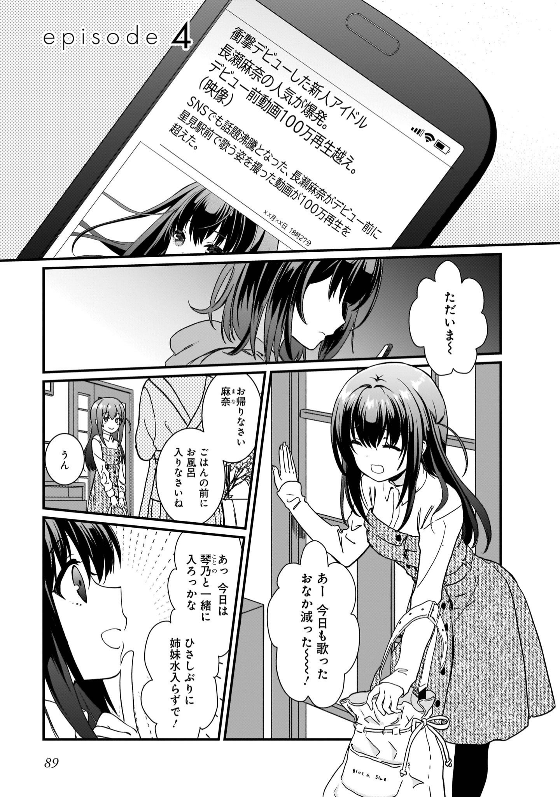
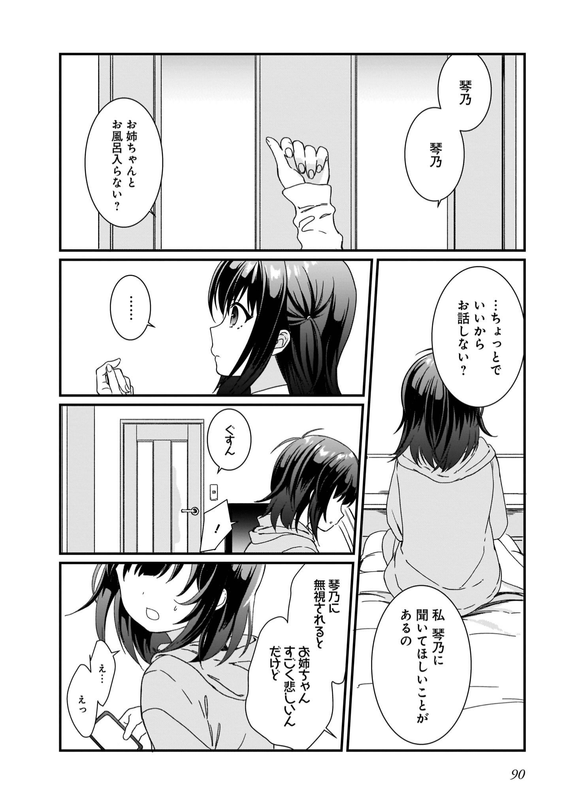

# P89 #

1. 「衝撃デビューした新人アイドル」
	1. 「冲击出道的新人偶像」
2. 「長瀬麻奈の人気が爆発。」
	1. 「长濑麻奈人气爆发。」
3. 「デビュー前動画100万再生越え。」
	1. 「出道前视频播放超过100万。」
4. 「SNSでも話題沸騰となった、長瀬麻奈がデビュー前に星見駅前で歌う姿を撮った動画が100万再生を超えた。」
	1. 「在SNS上也引起了话题，长濑麻奈出道前在星见车站前唱歌的视频超过了100万次播放。」
5. ただいま～～
	1. 我回来了~
6. あー今日も歌ったおなか減った～～～！
	1. 啊~今天也唱得肚子饿了~！
7. お帰りなさい　麻奈
	1. 欢迎回来　麻奈
8. ごはんの前にお風呂入りなさいね
	1. 吃饭前先洗澡吧
9. うん
	1. 嗯
10. あっ　今日は琴乃と一緒に姉妹水入らずで！
	1. 啊，今天和琴乃一起洗吧！

# P90 #

1. 琴乃　琴乃
2. お姉ちゃんとお風呂入らない？
	1. 要不要和姐姐一起洗澡？
3. …ちょっとで　いいから　お話しない？
	1. …一会儿就可以了，不说话吗？
4. 私　琴乃に聞いてほしいことがあるの
	1. 我有件事想问琴乃
5. …
6. ぐすん
	1. 呜呜
7. 琴乃に無視されると　お姉えちゃんすごく悲しいんだけど
	1. 被琴乃无视的话姐姐会很伤心的
8. え…えっ
	1. 诶…诶

# P91 #

1. お姉えちゃん！何も泣がなくても…
	1. 姐姐！不管怎样先别哭…
2. つかまえたー♡
	1. 抓住了♡
3. 私　演技のほうもなかなかでしょ？
	1. 我的演技也很不错吧？
4. …
5. 嫌い　離れて
	1. 讨厌，走开
6. まってまって　だまして悪がったよ
	1. 等一下等一下　骗你是我不好

# P92 #

1. でもたまにはお姉ちゃんの相手してくれても　いいじゃない？
	1. 但是偶尔也可以陪姐姐我吧？
2. 先に私から　距離をとったのはお姉ちゃんじゃない
	1. 先和我保持距离的不是姐姐吗
3. 前は夕食も一緒に食べてそのあと　たくさんおしゃべりしてた
	1. 以前一起吃晚饭，还会聊很久
4. 休みの日だって一緒に買い物行ったり…
	1. 休息日也一起去买东西…
5. でも今は毎日レッスンとライブ活動ばっかり
	1. 但是现在每天都是课程和演唱会活动
6. アイドルなんてやめてほしいって　あんなに言ったのに！
	1. 明明说过不做偶像的！
7. 最近毎日帰ってくるの真夜中だよね
	1. 最近每天都在深夜回来呢
8. そんなに働いて身体こわしたろどうするの
	1. 那么工作把身体搞坏了怎么办
9. なんでそうまでしてアイドル続けるの…？
	1. 为什么要一直这样做偶像…？
10. ステージで歌うのが好きだから…かな？
	1. 因为喜欢在舞台上唱歌…吧？
11. …じゃあ
	1. …那

# P93 #

1. 私とアイドル活動どっちがすき…？
	1. 你喜欢我还是偶像活动…？
2. ふふ　私と仕事どっちが大事なの？みたいだね
	1. 噗，好像在问“我和工作哪个重要”似的
3. 両方とも大好きだよ
	1. 两个都很喜欢
4. …私はお姉ちゃんがきらい
	1. …我讨厌姐姐
5. もう出てって！
	1. 快出去！
6. わっ　ちょっと　琴乃っ
	1. 哇，等一下，琴乃

# P94 #

1. 「バタンッ」
2. …琴乃ごめんね
	1. …琴乃对不起
3. さみしい思いさせちゃって…
	1. 让你感到寂寞…
4. でもっ　でもね　うたってすごいんだ
	1. 但是呢，唱歌是很棒的
5. みんなを元気にできる力があるの
	1. 是能让大家打起精神的力量
6. いつか私のステージ琴乃にも観てほしいな
	1. 总有一天也希望琴乃来看我的舞台
7. 絶対行かない
	1. 绝对不去
8. あはは…
	1. 啊哈哈…

# P95 #

1. そっか…
	1. 这样啊…
2. 琴乃にさみしい思いさせて
	1. 让琴乃感到寂寞
3. アイドルとしても全然まだまだで
	1. 作为偶像也完全不够
4. 牧野くんにも迷惑かけてばかりで
	1. 总是给牧野君添麻烦
5. 私ってダメだなぁ…
	1. 我可不行啊…
6. でも…私はーー…
	1. 但是…我…

# P96 #

1. そうか…
	1. 是吗…
2. 妹さん麻奈のアイドル活動に反対なんだな
	1. 妹妹反对麻奈的偶像活动啊
3. うん…ちょっと　ケンカしちゃった
	1. 嗯…稍微有点吵架了
4. でもたしかに最近仕事を入れすぎたかもしれないな
	1. 但是确实最近工作投入过多了吧
5. しばらく　セーブ　しようか
	1. 暂时节制下投入吧
6. ううん　いいの　デビューできたばっかりなんだよ！
	1. 不，不用了，刚刚出道不久呢！
7. 大丈夫　琴乃もいつかわかってくれるから！
	1. 没关系，琴乃也总有一天会明白的！
8. 長瀬麻奈さん　お願いしまーす！
	1. 长濑麻奈小姐，拜托了！
9. はーい！牧野くん　いってくるね
	1. 好！牧野君，我上台了
10. こんばんは！星見プロの長瀬麻奈でーす！
	1. 晚上好！我是星见pro的长濑麻奈ー！

# P97 #

1. …あいかわらずまぶしいな…
	1. …还是那么耀眼啊…
2. 妹さんだってこれをみれば…ん？
	1. 妹妹看了这个也会…嗯？
3. 麻奈危ない！！
	1. 麻奈　危险！！

# P98 #

1. ま…
	1. 牧…

# P99 #

1. 牧野くん！！
	1. 牧野君！！
2. ただいま…
	1. 我回来了…
3. お姉ちゃん！
	1. 姐姐！
4. 大丈夫！？事務所のひとから事故が起きたって…！
	1. 没关系！？听事务所的人说出了事故…！
5. 私は…大丈夫…
	1. 我…没关系…
6. でも　代わりに…
	1. 但是取而代之的是…

# P100 #

1. ねえ　お姉ちゃんやっばりアイドルなんてやめよう…？
	1. 呐　姐姐还是不要做偶像了吧…？
2. もし…また今日みたいなことがあったら…私…
	1. 如果…如果还有像今天这样的事情的话…我…
3. 琴乃…
4. 牧野くん　こないだはたいへんだったんだって？
	1. 听说牧野君最近很辛苦？

# P101 #

1. もう大丈夫なのかい？
	1. 已经没事了吗？
2. はい！少しかすめただけなのでまったく問題ないかったんですよ
	1. 是的！只是刮到了一下，所以完全没问题
3. この前のライブは中止になってしまったので　今日はがんばります
	1. 因为上次的演唱会中止了，所以今天要加油
4. な　麻奈？
	1. 麻…麻奈？
5. …麻奈？大丈夫か？もう出番だぞ
	1. …麻奈？没关系吗？该出场了
6. あ…うん…
	1. 啊…嗯…
7. あの事故のあとの最初のライブだもんな緊張して…
	1. 因为是那次事故之后的第一次的演唱会所以很紧张…
8. 私…
	1. 我…
9. 歌ってもいいのかな…
	1. 只要歌唱就可以了吧…

# P102 #

1. え？
2. 麻奈？
3. どうしたんだ　動きが今までと全然…
	1. 怎么了　动作和以前完全不一样…

# P103 #

1. 麻奈！？

