# P105 #

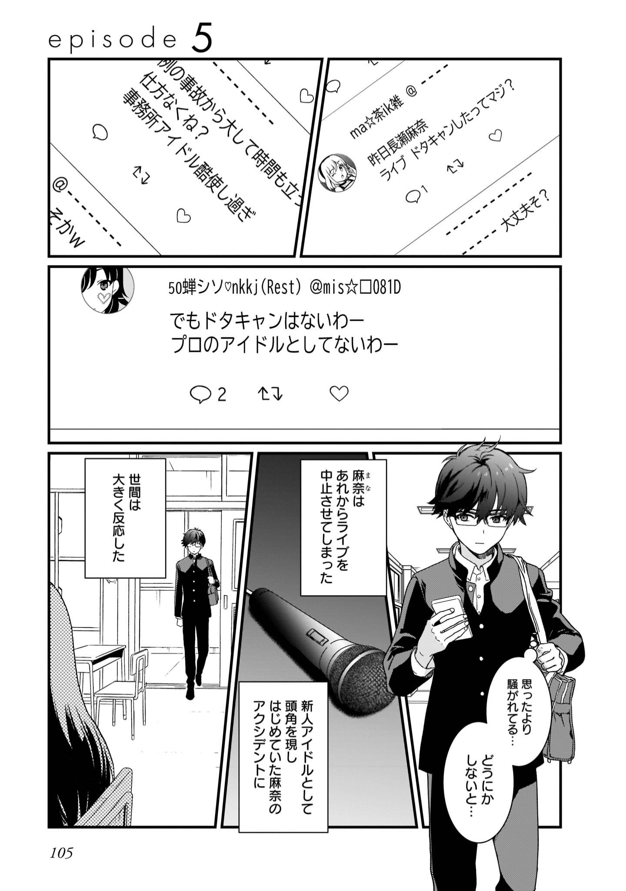

1. 「例の事故から大してじ時間も立ろ仕方なくね？事務所アイドル酷使し過ぎ」
	1. 「从那次事故开始要花很多时间　也没办法啊？事务所压榨偶像太过分了」
2. 「昨日長瀬麻奈ライブ　ドタキャンしたってまじマジ？」
	1. 「昨天长濑麻奈演唱会放鸽子是真的吗？」
3. 「でもドタキャンはないわー　プロのアイドルとしてないわー」
	1. 「放鸽子太过分了吧——　这可是职业偶像啊——」
3. 思ったより　騒がれてる　…　どうにかしないと…
	1. 比想象中还要吵闹…不想办法的话…
4. 麻奈はあれからライブを中止させてしまった
	1. 麻奈从那之后就中止了演唱会
5. 新人アイドルとして頭角を現し　はじめていた麻奈のアクシデントに
	1. 作为新人偶像开始崭露头角的麻奈的事件
6. 世間は大きく反応した
	1. 在社会上造成了很大的反应

# P106 #

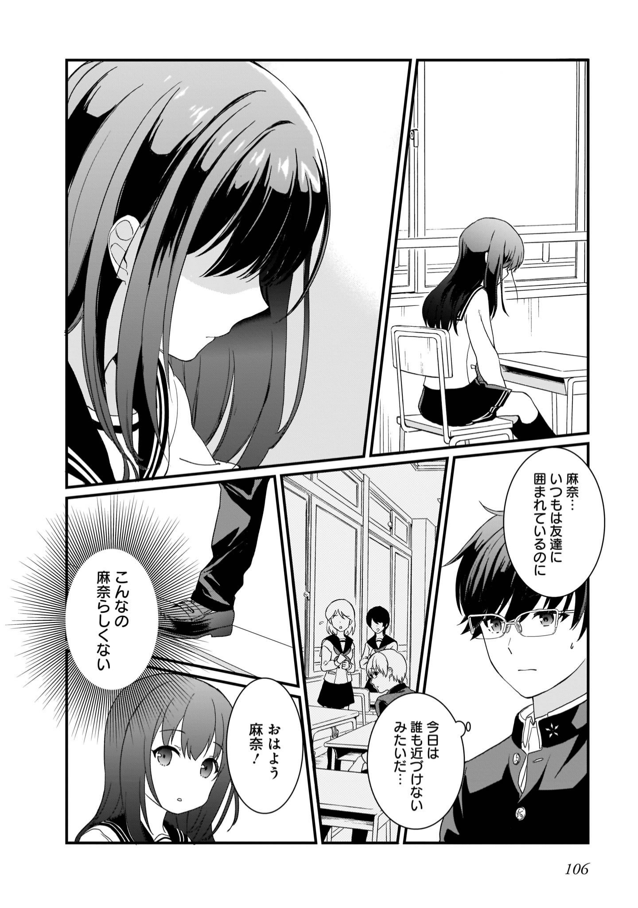

1. 麻奈…いつもは友達に囲まれているのに
	1. 麻奈…明明总是被朋友包围着
2. 今日は誰も近づけないみたいだ
	1. 今天好像没人靠近
3. こんなの麻奈らしくない
	1. 这不像麻奈
4. おはよう麻奈！
	1. 早上好　麻奈！

# P107 #

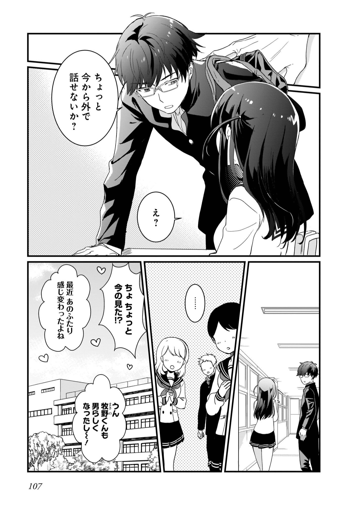

1. ちょっと今から外で話せないか？
	1. 现在能在外面说话吗？
2. え？
	1. 诶？
3. …
4. ちょ　ちょっと　今の見た！？
	1. 刚才　看见了吗！？
5. 最近　あのふたり感じ変わったよね
	1. 最近那两个人的感觉变了呢
6. うん　牧野くんも男らしくなったし～～～！
	1. 嗯　牧野君也变得有男子气概了～！

# P108 #

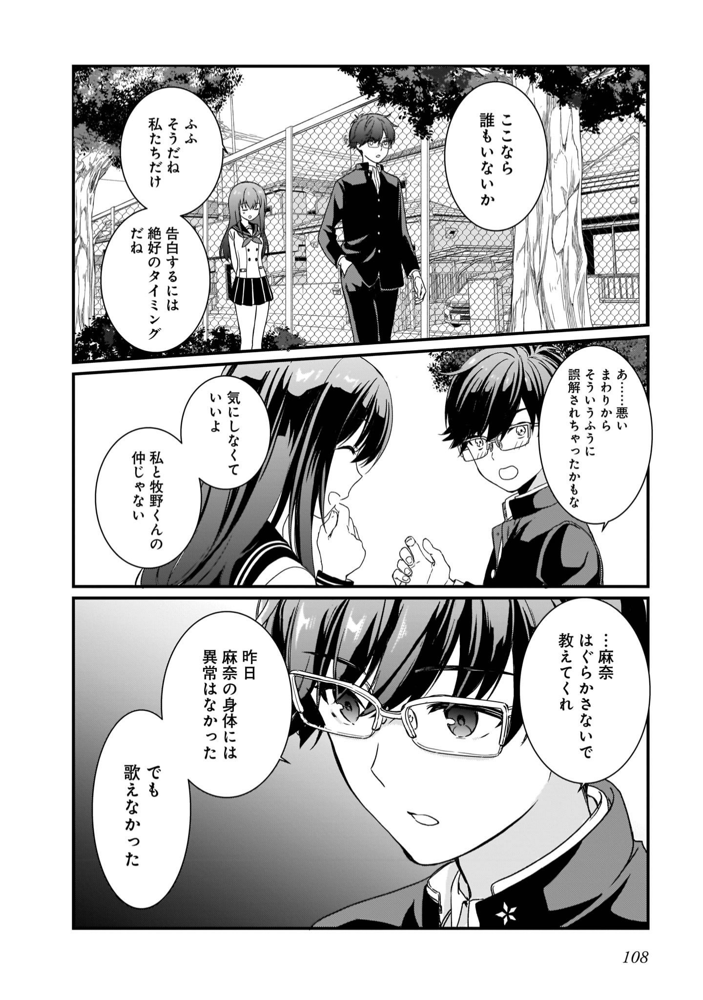

1. ここなら誰もいないか
	1. 这里没有别人吧
2. ふふ　そうだよね　私たちだけ
	1. 是啊只有我们
3. 告白するには絶好のタイミングだね
	1. 是告白的最佳时机哦
4. あ…悪い　まわりからそういうふうに　誤解きれちゃったかもな
	1. 啊…也许周围的人会这样误解我吧
5. 気にしなくていいよ　私と牧野くんの仲じゃない
	1. 不用在意，我和牧野君不是好朋友嘛
6. …麻奈　はぐらかきないで　教えてくれ
	1. …麻奈　请不要客气　告诉我
7. 昨日麻奈の身体には異常はなかった
	1. 昨天麻奈的身体没有异常
8. でも　歌えなかった
	1. 但是没能唱出来

# P109 #

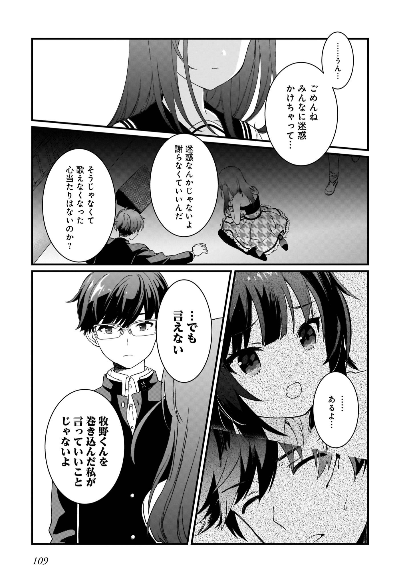

1. …うん　ごめんね　みんなに迷惑かけちゃって…
	1. …嗯，对不起，给大家添麻烦了…
2. 迷惑なんかじゃないよ　謝らなくていいんだ
	1. 没有什么麻烦的，不用道歉
3. そうじゃなくて　歌えなくなった　心当たりはないのか
	1. 不对 无法唱歌的原因 你有头绪吗
4. あるよ…
	1. 有啊…
5. でも　言えない
	1. 但是不能说
6. 牧野くんを　巻き込んだ私が　言っていいことじゃないよ
	1. 因为是我把牧野君卷进来的　所以这件事很难开口

# P110 #

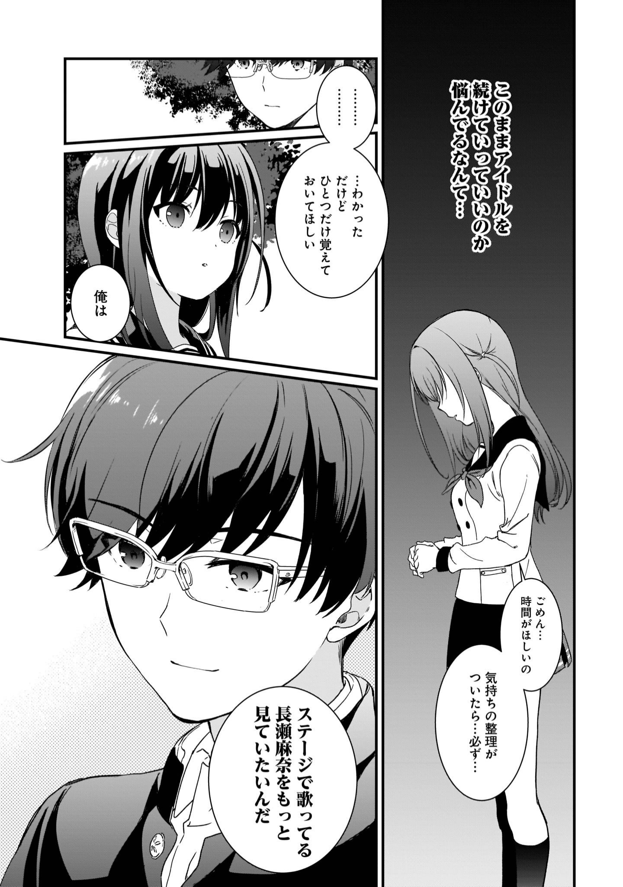

1. このままアイドルを続けていっていいのか　悩んでるなんて…
	1. 一直在烦恼要不要继续当偶像…
2. ごめん　時間がほしいの
	1. 对不起，我需要时间
3. 気持ちの整理がついたら…必ず…
	1. 整理好心情后…一定…
4. …
5. …わかった　だけと　ひとつだけ覚えておいてほしい
	1. …我知道了　只是请记住一件事
6. 俺は
	1. 我想
7. ステージで歌ってる　長瀬麻奈をもっと見ていたいんだ
	1. 多看看在舞台上唱歌的长濑麻奈

# P111 #

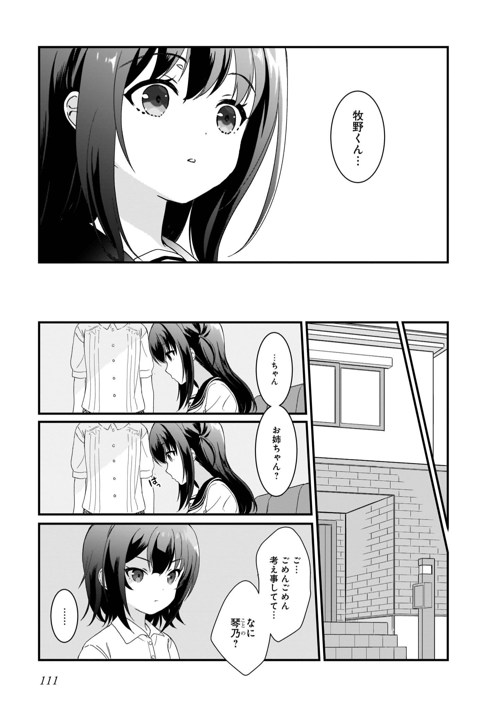

1. 牧野くん…
	1. 牧野君…
2. …ちゃん　お姉ちゃん？
	1. …那个…姐姐？
3. ご…ごめんごめん　考え事してて…
	1. ご…对不起，对不起，我在想事情…
4. なに　琴乃？
	1. 怎么了　琴乃？
5. …

# P112 #

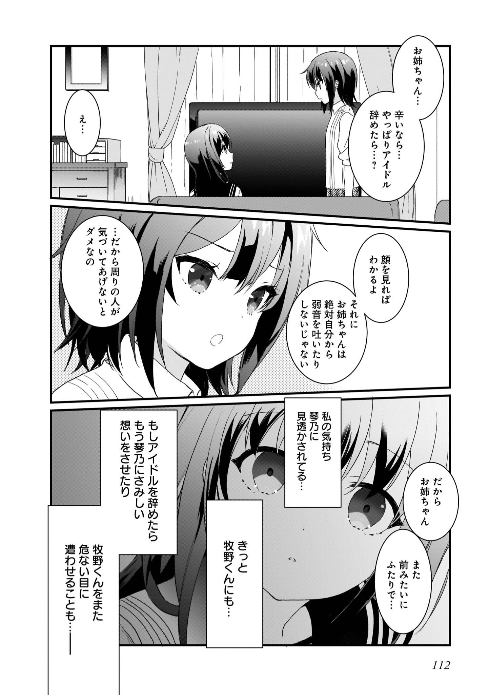

1. お姉ちゃん…
	1. 姐姐…
2. 辛いなら…やっばりアイドル辞めたら…？
	1. 如果很辛苦的话…还是放弃偶像吧…？
3. え…
	1. 嗯…
4. 顔を見ればわかるよ
	1. 看脸就知道了
5. それに　お姉ちゃんは絶対自分から弱音を吐いたりしないじゃない
	1. 而且 姐姐绝对不会自己示弱的
6. …だから周りの人が気づいておげないよダメなの
	1. …所以周围的人都没有注意到这样不行
7. だから　お姉ちゃん　また前にみたいにるたりで…
	1. 所以姐姐　就像以前一样　我们两个人…
8. 私の気持ち琴乃に見透かされてる…
	1. 我的心情被琴乃看穿了…
9. きっと　牧野くんにも
	1. 牧野君一定也一样吧
10. もしアイドルを辞めたらもう琴乃にさみしい　想いをさせたり
	1. 如果辞去偶像的工作的话，就不会让琴乃感到寂寞
11. 牧野くんをまた危ない目に遭わせることも…－－
	1. 也不会让牧野君再次遭遇危险…

# P113 #

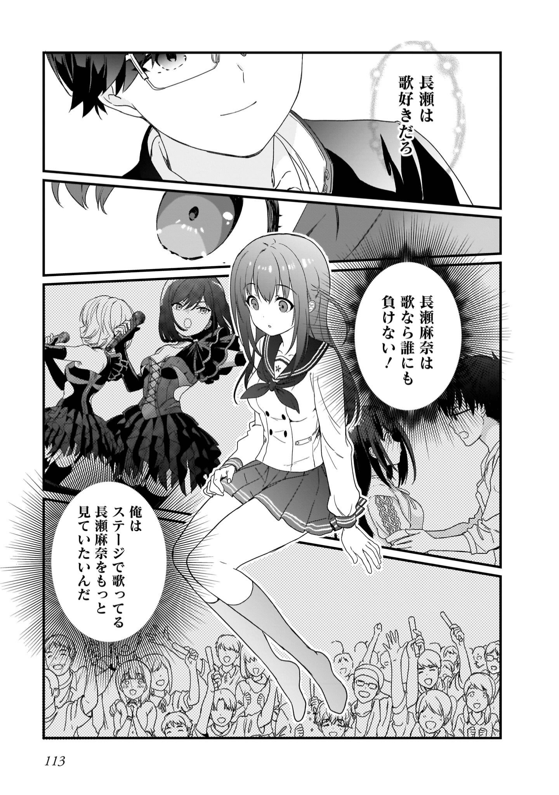

1. 長瀬は歌好きだろ
	1. 长濑喜欢唱歌吧
2. 長瀬麻奈は歌なら誰にも負けない！
	1. 长濑麻奈唱歌的话不会输给任何人！
3. 俺はステージで歌ってる　長瀬麻奈をもっと見ていたいんだ
	1. 我想多看看在舞台上唱歌的长濑麻奈

# P114 #

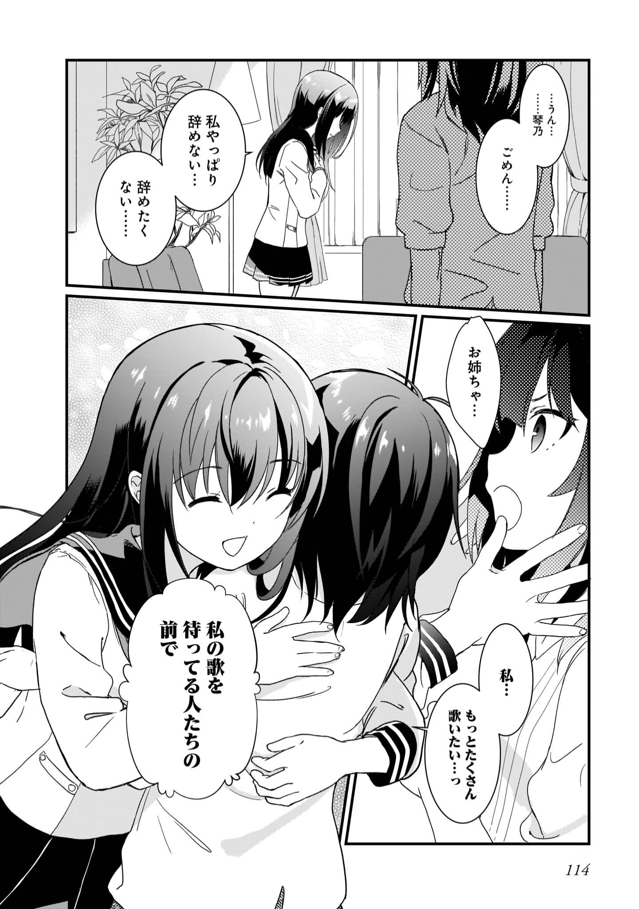

1. …うん…琴乃…ごめん
	1. …嗯…琴乃…对不起
2. 私やっばり辞めない…辞めたくない
	1. 我还是不放弃…不想放弃…
3. お姉ちゃ…
	1. 姐姐…
4. 私…もっとたくさんうたいたい…っ
	1. 我…想更多地歌唱…
5. 私の歌を待ってる人たちの前で
	1. 在等待着我的人面前

# P115 #

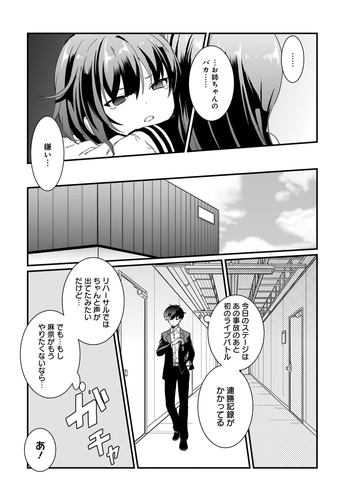

1. …
2. …お姉ちゃんのバカ…
	1. …姐姐个笨蛋…
3. 嫌い…
	1. 讨厌…
4. 今日のステージはあの事故のあと初のライブバトル
	1. 今天的舞台是那场事故之后的第一场现场演唱会
5. 連勝記録がかかってる
	1. 取得了连胜记录
6. リハーサルではちゃんと声が出てたみたいだけど…
	1. 彩排的时候好像有好好地发出声音…
7. でも…もし　麻奈がもうやりたくないなら…
	1. 但是…如果麻奈已经放弃了的话…
8. あ！
	1. 啊！

# P116 #

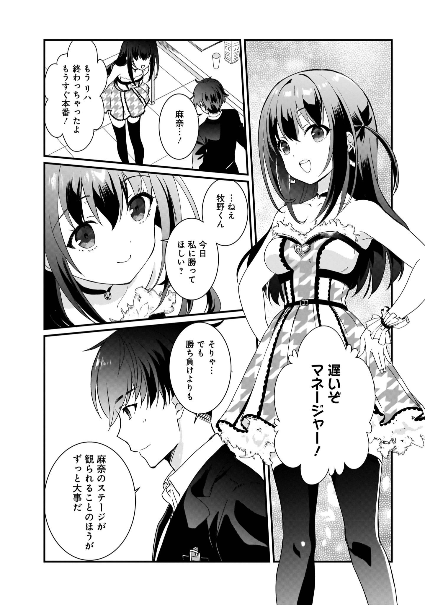

1. 遅いぞ　マネージャー！
	1. 好慢啊　经纪人！
2. 麻奈…！
3. もう　リハ終わっちゃったよ　もうすぐ本番！
	1. 彩排已经结束了哦　马上就要正式演出了！
4. …ねえ　牧野くん　今日私に勝ってほしい？
	1.  …喂　牧野君　今天希望我赢吗？
5. そりや…　でも勝ち負けよりも
	1. 那肯…但是比起胜负
6. 麻奈のステージが観られることのほうがづっと大事だ
	1. 能在舞台上看到麻奈更重要

# P117 #

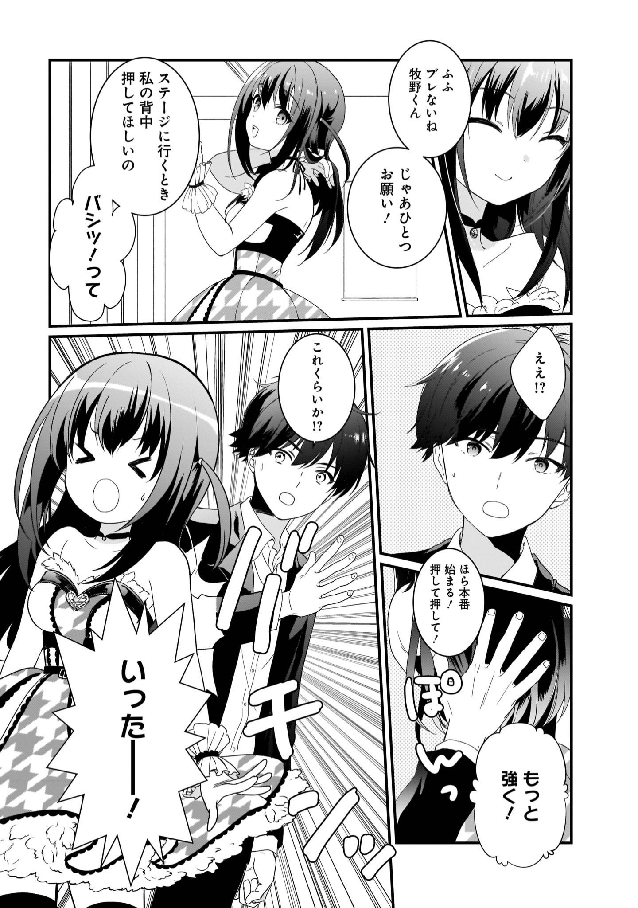

1. ふふ　ブレないね　牧野くん
	1. 嘻嘻　不会动摇吧牧野君
2. じゃあ一つお願い！
	1. 那就拜托你了！
3. ステージに行くとき　私の背中　押してほしいの　バシッ！って
	1. 去舞台的时候希望你能在我背上拍一下！
4. ええ
	1. 诶
5. ほら本番始まる！押して押して！
	1. 看　正式演出要开始了！拍一下拍一下！
6. もっと強く！
	1. 大力点！
7. これくらいか！？
	1. 这样子吗？
8. いったーー！
	1. 疼——

# P118 #

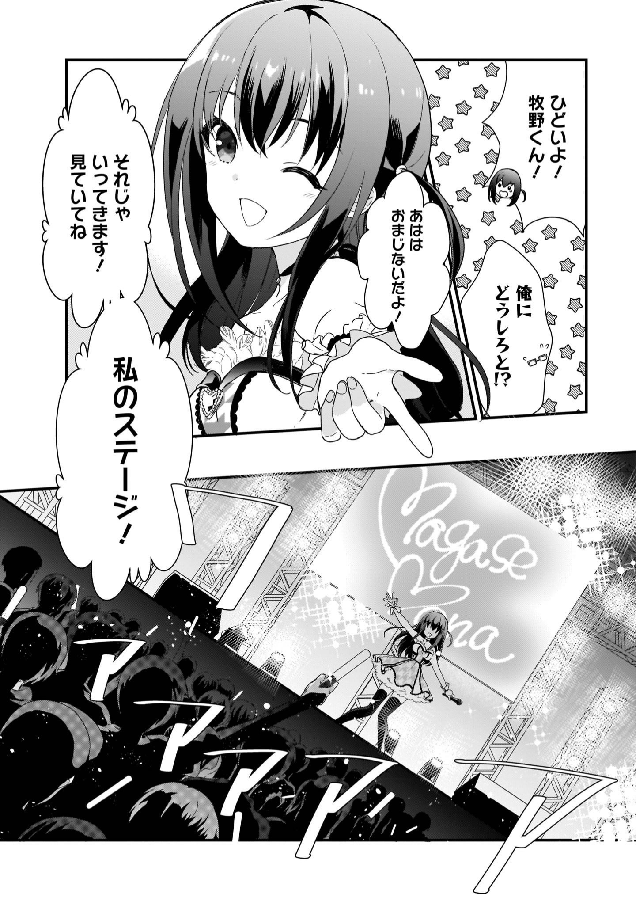

1. ひどいよ！牧野くん！
	1. 太过分了！牧野君！
2. 俺にどうしろと！？
	1. 让我怎么做！？
3. あはは　おまじないだよ！
	1. 啊哈哈 这是咒语哦！
4. それじゃ　いってきます！見ていてね
	1. 那么我走了！看好了
5. 私のステージ！
	1. 我的舞台！

# P119 #

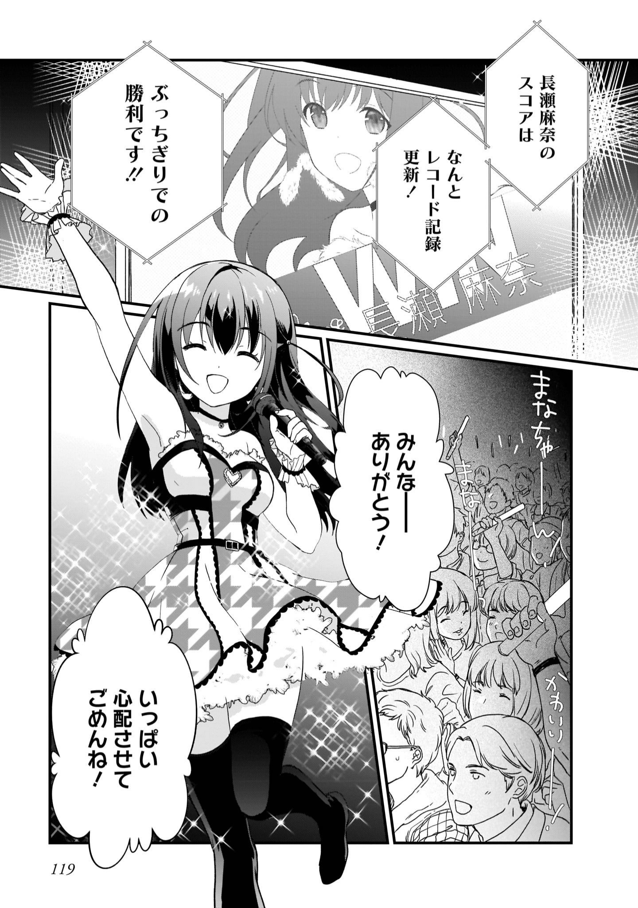

1. 長瀬麻奈のスコアは　なんとレコード記録更新！
	1. 长濑麻奈的成绩刷新了记录！
2. ぶっちぎりでの勝利です！！
	1. 绝对的胜利！！
3. みんなーーありがとう！
	1. 谢谢大家！
4. いっぱい心配させて　ごめんね！
	1. 多让大家担心了　对不起！

# P120 #

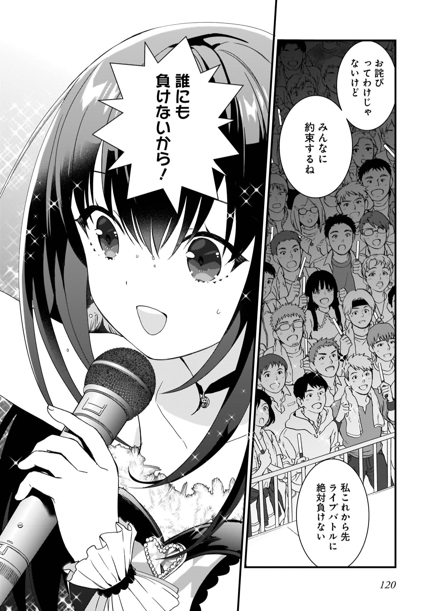

1. お詫びってわけじゃないけど　みんなに約束するね
	1. 这不是道歉 我在这里和大家约好了
2. 私れから先ライブバトルに絶対負けない
	1. 接下来的live战我绝对不会输
3. 誰にも負けないから
	1. 不会输给任何人

# P121 #

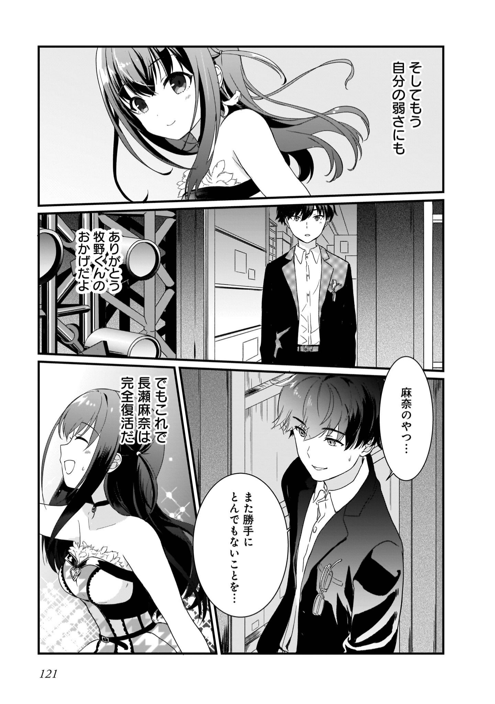

1. そしてもう自分の弱さにも
	1. 也不会输给自己的软弱
2. ありがとう　牧野くんのおかげだよ
	1. 谢谢你　多亏了牧野君
3. 麻奈のやつ…
	1. 麻奈那家伙…
4. また勝手にとんでもないことを…
	1. 又擅自做出了荒唐的事…
5. でもこれで長瀬麻奈は完全復活だ
	1. 但是这样长濑麻奈就完全复活了

# P122 #

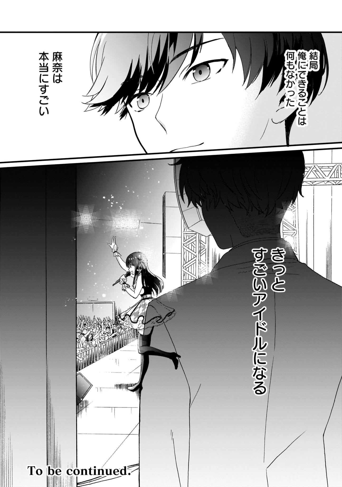

1. 結局俺にできることは何もなかった
	1. 结果我什么都没能做
2. 麻奈は本当にすごい
	1. 麻奈真的很厉害
3. きっと　すごいアイドルになる
	1. 一定会成为很厉害的偶像

